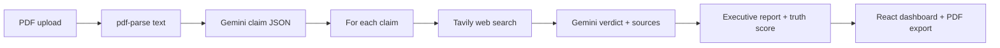

# TruthLens AI

TruthLens is a **production-style** claim verification product: upload a PDF, extract **high-signal factual claims** (numbers, dates, metrics—not opinions), retrieve **live web evidence** via Tavily, and adjudicate each claim with Gemini using **explicit sources**, **confidence**, and a **downloadable PDF report**.

## Live deployment

| Surface | Host | Notes |
|--------|------|------|
| Frontend | Vercel | Set `VITE_API_URL` to your API origin |
| Backend | Render | Set env vars from `server/.env.example` |

Replace the URLs below with your own after deploy:

- **App**: `https://YOUR_APP.vercel.app`
- **API**: `https://YOUR_SERVICE.onrender.com`

## Features

- **Claim targeting**: JSON-schema extraction of measurable claims only.
- **Live verification**: Tavily search → Gemini compares claim vs retrieved snippets.
- **Status model**: `VERIFIED`, `INACCURATE`, `FALSE`, `INSUFFICIENT_DATA` with color-coded UI.
- **Truth score**: Weighted aggregate across outcomes (see Architecture).
- **Executive report**: Summary + major issues + per-claim ledger.
- **Export**: Client-side PDF via `jspdf`.
- **UX**: Glass-style landing, Framer Motion, dark mode, animated pipeline messaging.
- **Optional persistence**: MongoDB Atlas stores runs when `MONGODB_URI` is set.

## Tech stack

| Layer | Choice |
|-------|--------|
| Frontend | React 18, Vite, TypeScript, Tailwind, Framer Motion, React Dropzone, Axios, jsPDF |
| Backend | Node 20+, Express, Multer, pdf-parse |
| LLM | Google Gemini (configurable model, default `gemini-2.0-flash`) |
| Search | Tavily |
| DB (optional) | MongoDB + Mongoose |

## Architecture



**Truth score (weighted):**

- `VERIFIED` → 100 points  
- `INACCURATE` → 60 points  
- `FALSE` → 0 points  
- `INSUFFICIENT_DATA` → 45 points  

Final score = `round(total_points / N)`.

**Why this beats “ask GPT if it’s true”:** each verdict is grounded in **retrieved URLs and snippets** first; the model **judges evidence**, it does not invent it.

## Repository layout

```
client/                 # Vite React app
  src/components/       # UI + PDF export
  src/services/         # API client
server/
  src/services/         # pdf, claims, search, verify, report
  src/routes/           # HTTP routes
  src/models/           # Mongo (optional)
```

## Troubleshooting

### `EADDRINUSE` on port 5000

Something else is already listening on **5000**. On some Windows setups **PostgreSQL** uses it—do not kill `postgres` unless you know what you’re doing.

Use another port for this API:

1. In `server/.env`: `PORT=5001`
2. Create `client/.env.development`: `VITE_DEV_API_TARGET=http://localhost:5001`
3. Restart `npm run dev` in both folders.

### Gemini `429` / quota / rate limits

Google returns **429 Too Many Requests** when free-tier RPM/TPM/day limits are hit or when a model has **no quota** for your project.

- Wait ~1 minute and try again; the server **retries** on 429 using Google’s suggested delay.
- In `server/.env`, try another model: `GEMINI_MODEL=gemini-1.5-flash` or `GEMINI_MODEL=gemini-2.5-flash` (names vary by API version—check [Google AI Studio](https://aistudio.google.com/) list for your key).
- Reduce load: lower `MAX_CLAIMS_TO_VERIFY` (e.g. `8`).
- For sustained use, enable billing / higher limits on your Google Cloud / AI Studio project.

### MongoDB `querySrv ECONNREFUSED`

Atlas SRV lookup failed (network, firewall, VPN, or wrong URI). For local dev you can **remove `MONGODB_URI`** from `.env`—the API runs without persistence.

## Local setup

### 1) API keys

- **Gemini**
- **Tavily**
- **MongoDB** 

### 2) Backend

```bash
cd server
cp .env.example .env
# Fill GEMINI_API_KEY and TAVILY_API_KEY
npm install
npm run dev
```

Server listens on `http://localhost:5001`.

### 3) Frontend

```bash
cd client
npm install
npm run dev
```

Vite proxies `/api` → `http://localhost:5137` in development.

### 4) Production env

**Render (API)**

- `GEMINI_API_KEY`, `TAVILY_API_KEY`
- `CLIENT_ORIGIN` = your Vercel origin, e.g. `https://truthlens-ai.vercel.app`
- Optional: `MONGODB_URI`, `MAX_CLAIMS_TO_VERIFY` (default 18)

**Vercel (UI)**

- Set the project **Root Directory** to `client`.
- `VITE_API_URL` = `https://YOUR_RENDER_SERVICE.onrender.com` (no trailing slash)

## API

### `POST /api/verify`

`multipart/form-data` field **`file`** (PDF).

Returns JSON with `truthScore`, `summary`, `stats`, `majorIssues`, and `results[]` (per-claim verdicts + sources).

### `GET /api/history`

Recent jobs when MongoDB is enabled.

### `GET /api/health`

Service metadata and key presence flags.


1. **0–5s**: Landing — “TruthLens verifies factual claims in PDFs using live web data.”
2. **5–15s**: Upload a PDF → show extraction + verification animation.
3. **15–25s**: Zoom truth score, false/inaccurate rows, corrected figures.
4. **25–30s**: Show deployed Vercel URL + GitHub repo link.


